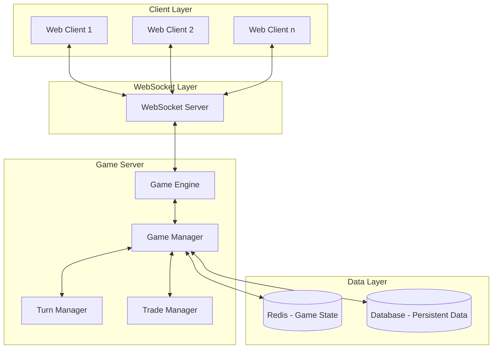
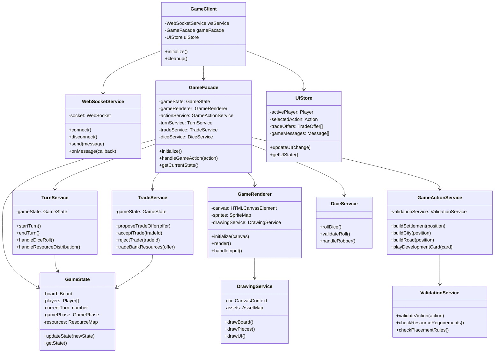

# Colonist - Catan like game in pixel art

## Graphics

All graphics have been designed in [photopea](https://photopea.com).

Game sprites are added to a single sprite sheet of size 2048x2048 and shipped in `.webp` or `.png` format based on browser support.

### Sprites

- `settlements/cities` 64x64 pixels
- `roads` 32x128 pixels (accommodates for rotation)
- `resource` icons 32x32 pixels
- `port` icons 48x48 pixels
- `hex` tiles 256x256 pixels (accommodates for detail)
- `dice` icons 48x48 pixels

## High level architecture

### Client architecture

## Game Logic

- Default Board has to include the following:
  - 4 wood
  - 4 sheep
  - 4 wheat
  - 3 stone
  - 3 brick
  - 1 desert

# notes

- Static site with 2 options (create, join)
-
